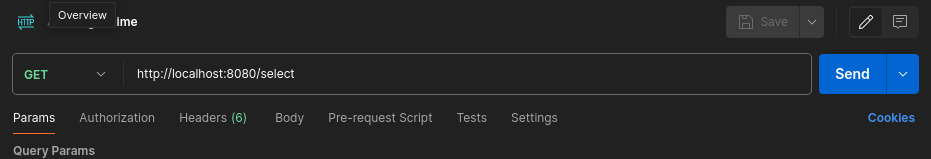
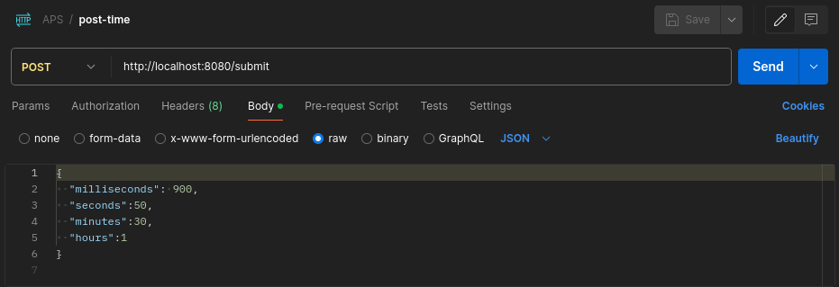

# Contador de Voltas com Temporizador

## Introdução

Este documento descreve o projeto de um contador de voltas com temporizador, desenvolvido como parte de um trabalho acadêmico. O objetivo do projeto é temporizar duas voltas de um carrinho de controle remoto durante um percurso, registrando os tempos das voltas no banco de dados MySQL. O projeto foi implementado utilizando Java e Maven para gerenciamento de dependências. O ambiente de desenvolvimento incluiu o IntelliJ IDEA, BDeaver e XAMPP.

## Ferramentas Utilizadas

- **Java (Java SE, JDK Amazoncorretto 22)**: Versão do JDK(Java Development Kit).
- **Maven (3.9.6)**: Ferramenta de gerenciamento de dependências.
- **MySQL (8.3.0)**: SGBD utilizado para armazenar os dados.
- **Docker (25.0.3)**: Utilizado para configurar e gerenciar os contêineres do Server HTTP e MySQL.

## Ambiente de Desenvolvimento

- **IntelliJ**: Ambiente de desenvolvimento integrado utilizado para escrever, compilar e depurar o código-fonte do projeto.
- **BDeaver**: Ferramenta de administração de banco de dados MySQL.
- **XAMPP**: Facilita a instalação e gerenciamento de um servidor web local, incluindo MySQL, Apache e PHP, utilizado para testar o banco de dados.

## Funcionalidades

O projeto consiste em um contador de voltas com temporizador que realiza as seguintes funcionalidades:

1. **Temporização de Voltas**: O sistema é capaz de temporizar duas voltas de um carrinho de controle remoto durante um percurso.
2. **Registro de Tempos**: Os tempos das voltas são registrados em um banco de dados MySQL para posterior análise e visualização.
3. **Reset Automático**: Após temporizar a primeira volta, o sistema reseta o temporizador para temporizar a segunda volta.
4. **Integração com Banco de Dados**: Utiliza o MySQL para armazenar os dados das voltas, incluindo o tempo de cada volta e outros detalhes relevantes.
5. **Mostra as voltas**: Após armazenar os valores é possível fazer uma busca das duas ultimas voltas armazenadas e realizar uma soma e demostrar em tela.

## Estrutura do Projeto

A estrutura do projeto segue um padrão comum de projetos Java, incluindo a organização de pacotes, classes e recursos. As principais classes e pacotes do projeto incluem:

- **`lap-counter-aps`**: Diretório raiz entre o back-end e o front-end.
  - **`backend-counter`**: Diretório contendo o código-fonte do back-end Java.
      - **`src.main.java.org.server`**: Pacote principal do projeto.
          - **`http.HttpServerManager.java`**: Classe principal do programa, responsável por iniciar a aplicação e subir o servidor http.
            - **`routes.RouteSelectHandler.java`**: Classe responsável por criar a rota http que busca os últimos valores e retorna eles juntamente a soma.
            - **`routes.RouteSubmitHandler.java`**: Classe responsável por criar a rota http que insere os valores dentro do banco de dados.
          - **`model.ModelMethods.java`**: Interfaces dos métodos presentes para as classes de conexão com o banco de dados.
          - **`model.DatabaseConnectionManage.java`**: Classe responsável pelo pool e fechamento da conexão com o MySQL.
          - **`model.QueryExecutorImpl.java`**: Classe responsável por fazer a implementação de dados por meio de uma procedure.
          - **`model.QueryExecutorSele.java`**: Classe responsável por fazer select dos dois últimos dados inseridos.
  - **`pom.xml`**: Arquivo de configuração do Maven, onde são definidas as dependências e configurações do projeto.
  - **`.env`**: Arquivo que contem as variáveis de ambiente do projeto
    ```
    MYSQL_URL: URL de conexão JDBC para o MySQL.
    MYSQL_DATABASE: Nome do banco de dados MySQL.
    MYSQL_USER: Nome de usuário do MySQL.
    MYSQL_ROOT_PASSWORD: Senha do usuário root do MySQL.
  - **`Dockerfile`**: Arquivo para subir a imagem docker.
  - **`docker-compose.yml`**: Arquivo para subir os containers.

## Configuração e Execução

Para configurar e executar o projeto em seu ambiente local, siga os passos abaixo:

1. Certifique-se de ter o JDK Amazon Corretto 22 (Versão similar) e o Maven 3.9.6 instalados em seu sistema.
2. Instale o Docker em seu sistema para configurar o banco de dados MySQL.
3. Clone o repositório do projeto em sua máquina local.
4. Utilize o Docker para criar e iniciar um contêiner MySQL e o server HTTP com as configurações necessárias.
5. Configure as informações de conexão com o banco de dados no arquivo `.env` seguindo o padrão supracitado.
6. Dentro do docker vá nos arquivos do seu projeto e altere os valores do .env dentro do diretório /app.

## Links 

- Imagem: [Docker hub](https://hub.docker.com/repository/docker/viniciusgggabriel/backend-counter-server/general)
- Documentações e artigos: [Learn java](https://dev.java/learn/), [MySQL documentação](https://dev.mysql.com/doc/), [Imagem maven e jdk](https://hub.docker.com/explore)
- Videos: [JDBC 01](https://youtu.be/VSWXK5j7sH0?si=J5Qo8rOEWNpMUpEf), [JDBC 02](https://youtu.be/YVRp4bpow48?si=LotM8_62B75dAxY9), [Java Swing](https://youtube.com/playlist?list=PLwH4Cv_WLhLbc4H-aOh3xFywPGxhaso_b&si=8MHZyM4Ql9XK1Q7n), [Docker image](https://www.youtube.com/watch?v=t9L__Y0E5OY&list=WL&index=5)

## Anexos

- **Get dos valores**

    
- **Post dos valores**

    